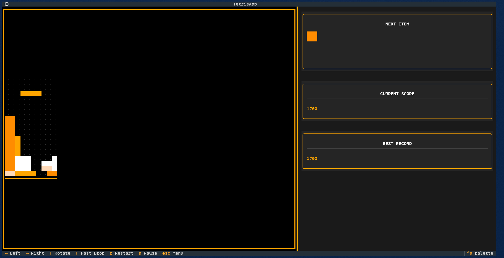

# تتریس در ترمینال! 🚀

این یه بازی ساده تتریس هست که با پایتون و کتابخونه `textual` ساخته شده و توی ترمینال یا همون Command Prompt اجرا می‌شه. ظاهرش سعی شده شبیه بازی‌های کلاسیک باشه.



## 🎮 ویژگی‌ها

- گیم‌پلی کلاسیک تتریس
- نمایش امتیاز فعلی و بالاترین رکورد
- نمایش مهره بعدی
- منوی شروع و دکمه‌های کنترلی
- امکان توقف (Pause) و شروع مجدد بازی
- ذخیره شدن بالاترین امتیاز برای همیشه

## 🛠️ نصب و اجرا (از سورس‌کد)

اگه می‌خوای سورس‌کد رو خودت اجرا کنی، مراحل زیر رو دنبال کن:

۱. **کلون کردن پروژه:**
اول باید کدهای پروژه رو از گیت‌هاب دانلود کنی. برای این کار، ترمینال (یا Git Bash) رو باز کن و دستور زیر رو بزن:

```bash
git clone https://github.com/MMETehrani/cli-tetris-tui.git
```
بعدش با دستور `cd cli-tetris-tui` وارد پوشه پروژه شو.

۲. **نصب کتابخانه‌های مورد نیاز:**
این پروژه به چندتا کتابخونه پایتون نیاز داره که اصلی‌ترینش `textual` هست. با دستور زیر نصبش کن:

```bash
pip install textual
```

۳. **اجرای بازی:**
حالا کافیه فایل اصلی پایتون رو اجرا کنی:

```bash
python main.py
```

و تمام! بازی توی همون پنجره ترمینال برات اجرا می‌شه. لذت ببری! 😉

## ⌨️ کنترل‌های بازی

- **حرکت به چپ:** `←` (کلید فلش چپ)
- **حرکت به راست:** `→` (کلید فلش راست)
- **چرخش مهره:** `↑` (کلید فلش بالا)
- **سقوط سریع:** `↓` (کلید فلش پایین)
- **توقف/ادامه:** `P`
- **شروع مجدد:** `R`
- **خروج به منو:** `Escape`
- **خروج کامل از برنامه:** `Ctrl+C`

---
ساخته شده با ❤️ و پایتون.